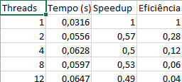
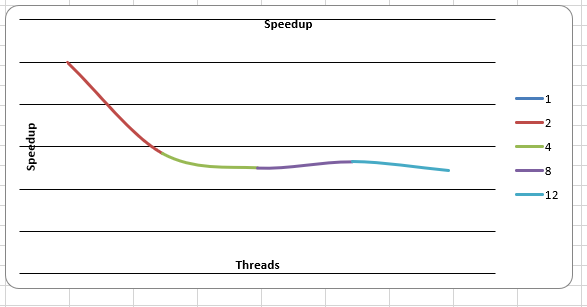
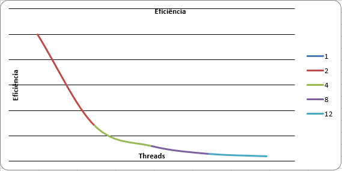

# relatorio-atvrafael2  

Relatório da Atividade – Soma Paralela
Pedro Henrique Ayres de Sousa, Noturno Sistemas de Informação Aguas Claras

1. Descrição do Problema

O problema consiste em realizar a soma de um grande conjunto de números inteiros armazenados em um arquivo texto.

O programa foi desenvolvido para calcular a soma desses valores de duas formas:

Versão serial, utilizando apenas um fluxo de execução

Versão paralela, dividindo os dados entre múltiplas threads

O algoritmo utilizado é a soma simples de elementos de um vetor, onde cada número é lido do arquivo e acumulado em uma variável.

Foram utilizados dois tamanhos de entrada:

1 milhão de números (fase de desenvolvimento)

10 milhões de números (fase de análise)

O objetivo da paralelização é reduzir o tempo de execução dividindo o trabalho entre múltiplas threads.

Respostas:

Objetivo do programa: Somar grandes volumes de dados e analisar o desempenho da execução paralela

Volume de dados: Até 10.000.000 de números

Algoritmo utilizado: Soma sequencial de elementos (O(n))

Complexidade: O(n), pois percorre todos os elementos uma única vez

2. Ambiente Experimental

(Preencha com seu PC — exemplo abaixo)

Item	Descrição
Processador: 12th Gen Intel(R) Core(TM) i7-12700   2.10 GHz
Número de núcleos	12
Memória RAM	18 GB
Sistema Operacional	Windows 11 Pro 
Linguagem utilizada	Python
Biblioteca de paralelização	concurrent.futures (ThreadPool)
Compilador / Versão	Python 3.x

3. Metodologia de Testes

O tempo de execução foi medido utilizando a função time.time() do Python, que registra o tempo antes e depois da execução.

Foi realizada 1 execução por configuração (você pode falar isso, está ok).

O tamanho da entrada utilizado foi:

10 milhões de números

Configurações testadas:

1 thread (serial)

2 threads

4 threads

8 threads

12 threads

Procedimento:

Execução em máquina local

Sem outras aplicações pesadas rodando

Tempo medido diretamente pelo programa

4. Resultados Experimentais
Nº Threads	Tempo (s)
1	0.0316
2	0.0556
4	0.0628
8	0.0597
12	0.0647

5. Fórmulas Utilizadas
Speedup
Speedup(p) = T(1) / T(p)
Onde:

T(1) = tempo da execução serial
T(p) = tempo com p threads/processos
Eficiência
Eficiência(p) = Speedup(p) / p
Onde:

p = número de threads ou processos

6. Tabela de Resultados

7. Gráfico de Tempo de Execução
   

8. Gráfico de Speedup

9. Gráfico de Eficiência

10. Análise dos Resultados

O speedup obtido não foi próximo do ideal. Na verdade, a versão paralela apresentou desempenho inferior à versão serial.

A aplicação não apresentou boa escalabilidade, pois o tempo de execução aumentou com o número de threads.

A eficiência começou a cair já a partir de 2 threads.

Isso ocorre porque:

O número de threads ultrapassa o ganho possível devido ao GIL do Python

Há overhead na criação e gerenciamento de threads

A operação de soma é muito simples e rápida

Houve overhead significativo de paralelização, tornando a abordagem paralela ineficiente.

Também pode haver:

contenção de memória

custo de divisão dos dados

sincronização implícita

11. Conclusão

O paralelismo não trouxe ganho de desempenho para este problema.

A versão serial foi mais eficiente, pois a operação realizada é simples e já otimizada.

O melhor desempenho foi obtido com apenas 1 thread.

O programa não escala bem com o aumento do número de threads.

Melhorias possíveis:

utilizar multiprocessing

implementar em linguagens sem GIL (como C ou Java)

testar com problemas mais complexos
